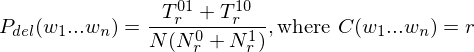

# Knowledge-base-for-Word-Prediction

Project By Roy Ash & Amit Binenfeld.

## Project Description:

We will generate a knowledge-base for Hebrew word-prediction system, based on Google 3-Gram Hebrew dataset, using Amazon
Elastic Map-Reduce (EMR). The produced knowledge-base indicates the probability of each word trigram found in the
corpus. In addition, We examined the quality of our algorithm according to statistic measures and manual analysis.

## Running instructions:

Look at https://aws.amazon.com/datasets/google-books-ngrams/ for possible values.

1. Create an S3 bucket.
2. Compile the project and create a jar with `il/co/dsp211/assignment2/steps/step1/EMR.java` as your main class.
3. Upload your jar to your S3 bucket.
4. Fill `config.properties` file with the followings:
	1. `bucketName` - The name of your bucket you've created at step 1, for saving temporary and final results and logs.
	2. `isWithCombiners` - With one of the following options:
		* `TRUE` - If you want to run this cluster **with** combiners.
		* `FALSE` - If you want to run this cluster **without** combiners.
		* `BOTH` - If you want to run **both** options, in such case this program will create 2 folders for the products
		  of this program, one for each option.
	3. `jarFileName` - The name of the jar you've created at step 2 **without extension**.
	4. `instanceCount` - The number of EC2 instances in the cluster.
	5. `region` - The region of your cluster you want to create.
	6. `singleLetterInAWordRegex` - A regex expression, that determains what are the legal characters in a word.
	7. `wordsBucket` - The bucket containing the records in "short" form, i.e `heb-all` or `eng-us-all`.
5. Run `il/co/dsp211/assignment2/Main.java`.
6. The final output will be presented inside `FinalOutput` folder.

## Map-Reduce Program Flow:

### Step 1: Filter & Divide

* For each record we're checking if it consists of 3 words (TriGram) with hebrew letters without special characters in
  order to evaluate a valid trigram entities.
* We divide the corpus in to two pars with a mod 2 operation and combine occurrences in both parts in order to get the
  sum of all the trigrams.

### Step 2: Calculate variables

* We calculate the Tr and Nr values in order to prepare for the **deleted estimation** method.

### Step 3: Join Trigrams with Tr and Nr

* Match trigram with their Tr and Nr for a specific r.

### Step 4: Probability Calculation

* We calculate the probability and match it with it's Trigram.

Where:

* N is the number of n-grams in the whole corpus.
* Nr0 is the number of n-grams occuring r times in the first part of the corpus.
* Tr01 is the total number of those n-grams from the first part (those of Nr0) in the second part of the corpus.
* Nr1 is the number of n-grams occuring r times in the second part of the corpus.
* Tr10 is the total number of those n-grams from the second part (those of Nr1) in the first part of the corpus.

### Step 5: Sorting

- We sort the trigrams by their first word, then second and lastly with their probability.

## Statistics With | Without Combiners:

- We did it on `AWS cluster` with `emr-6.2.0` configuration (the latest configuration at this moment)
  with `Hadoop v3.2.1` and with 3 instances of `M5.XLarge`, it took about 6 minutes with combiners and also without them
  to perform this task.

1. Map-Reduce Job1DivideCorpus:

   |                               | With combiners | Without combiners |
   |-------------------------------|----------------|-------------------|
   | Map input records             | 163,471,963    | 163,471,963       |
   | Map output records            | 71,119,513     | 71,119,513        |
   | Map output bytes              | 2,400,202,188  | 2,400,202,188     |
   | Combine input records         | 71,119,513     | Non existing      |
   | Combine output records        | 3,372,257      | Non existing      |
   | Map output materialized bytes | 42,386,294     | 307,746,702       |
   | Reduce input records          | 3,372,257      | 71,119,513        |
   | Reduce output records         | 1,686,118      | 1,686,118         |

2. Map-Reduce Job2CalcT_rN_r:

   |                               | With combiners | Without combiners |
   |-------------------------------|----------------|-------------------|
   | Map input records             | 1,686,118      | 1,686,118         |
   | Map output records            | 3,372,236      | 3,372,236         |
   | Map output bytes              | 84,305,900     | 57,328,012        |
   | Combine input records         | 3,372,236      | Non existing      |
   | Combine output records        | 13,995         | Non existing      |
   | Map output materialized bytes | 144,353        | 10,482,224        |
   | Reduce input records          | 13,995         | 3,372,236         |
   | Reduce output records         | 6,881          | 6,881             |

3. Map-Reduce Job3JoinTriGramsWithT_rN_r:

   |                               | Without combiners |
   |-------------------------------|-------------------|
   | Map input records             | 1,692,999         |
   | Map output records            | 3,379,117         |
   | Map output bytes              | 118,694,754       |
   | Combine input records         | Non existing      |
   | Combine output records        | Non existing      |
   | Map output materialized bytes | 52,550,247        |
   | Reduce input records          | 3,379,117         |
   | Reduce output records         | 3,372,236         |

4. Map-Reduce Job4CalcProb:

   |                               | Without combiners |
   |-------------------------------|-------------------|
   | Map input records             | 3,372,236         |
   | Map output records            | 3,372,236         |
   | Map output bytes              | 138,784,160       |
   | Combine input records         | Non existing      |
   | Combine output records        | Non existing      |
   | Map output materialized bytes | 45,672,812        |
   | Reduce input records          | 3,372,236         |
   | Reduce output records         | 1,686,118         |

5. Map-Reduce Job5Sort:

   |                               | Without combiners |
   |-------------------------------|-------------------|
   | Map input records             | 1,686,118         |
   | Map output records            | 1,686,118         |
   | Map output bytes              | 55,903,136        |
   | Combine input records         | Non existing      |
   | Combine output records        | Non existing      |
   | Map output materialized bytes | 31,454,674        |
   | Reduce input records          | 1,686,118         |
   | Reduce output records         | 1,686,118         |

We've reached the conclusion that using local aggregation lowers the network traffic but uppers the map output bytes
size in contrast to running without local aggregation where the network traffic is higher, but the map output bytes size
is lower. Both programs ran approximately at a similar time, so we would recommend using each method according to the
developer needs.

## Analysis:

1. [אולי, את]
	* אולי את רוצה 7.874418037545503E-7
	* אולי את יודעת 4.883619239192564E-7
	* אולי את יכולה 3.220178036782423E-7
	* אולי את צודקת 3.1002937759053363E-7
	* אולי את לא 2.799282451316188E-7

2. [אולי, בעוד]
	* אולי בעוד חמש 1.8736139499924197E-7
	* אולי בעוד כמה 1.4749080638407242E-7
	* אולי בעוד שנה 1.2859976681841917E-7
	* אולי בעוד חודש 1.1563962198793153E-7
	* אולי בעוד שבוע 1.0597609510855886E-7

3. [הוא, הלך]
	* הוא הלך בשדות 1.4042309449027945E-6
	* הוא הלך אל 1.226757709923042E-6
	* הוא הלך לעולמו 6.29156965814989E-7
	* הוא הלך עם 6.250497045355961E-7
	* הוא הלך בדרך 5.697315567021594E-7

4. [לפי, התפיסה]
	* לפי התפיסה הזאת 2.888728008966653E-7
	* לפי התפיסה של 2.79295543668843E-7
	* לפי התפיסה המקובלת 2.602789808179864E-7
	* לפי התפיסה היהודית 2.3221052578616006E-7
	* לפי התפיסה המקראית 2.3120826526433754E-7

5. [לפני, מלחמת]
	* לפני מלחמת העולם 1.7372895517511355E-5
	* לפני מלחמת ששת 4.06916166414147E-6
	* לפני מלחמת יום 1.6874587169695083E-6
	* לפני מלחמת העצמאות 8.134596367773261E-7
	* לפני מלחמת השחרור 6.782912474769619E-7

6. [לקראת, סיום]
	* לקראת סיום המלחמה 7.3535577556978E-7
	* לקראת סיום הסיפור 2.2293927332296132E-7
	* לקראת סיום מלחמת 2.0656172816575414E-7
	* לקראת סיום המנדט 1.7984458269530804E-7
	* לקראת סיום השיר 1.582786918303269E-7

7. [לשוב, לארץ]
	* לשוב לארץ ישראל 1.073170200329749E-6
	* לשוב לארץ אבותינו 5.218313010102185E-7
	* לשוב לארץ אבותיהם 2.195792737338246E-7
	* לשוב לארץ אבותיו 2.1700541111812384E-7
	* לשוב לארץ מולדתו 1.908476591204561E-7

8. [לשכנע, את]
	* לשכנע את הציבור 1.1936756193528124E-6
	* לשכנע את עצמו 1.1808972170794258E-6
	* לשכנע את עצמי 1.1183554381191736E-6
	* לשכנע את חברי 9.539185133667486E-7
	* לשכנע את הקורא 9.303467565777595E-7

9. [מטעם, ממשלת]
	* מטעם ממשלת המנדט 5.833761018386395E-7
	* מטעם ממשלת ישראל 5.096364306545669E-7
	* מטעם ממשלת בריטניה 3.3100783314412263E-7
	* מטעם ממשלת צרפת 1.7979896858162213E-7
	* מטעם ממשלת ארצות 1.7957169621806355E-7

10. [שנים, לפני]
	* שנים לפני כן 6.788388624981126E-6
	* שנים לפני מותו 1.1212090921006192E-6
	* שנים לפני זה 7.022118056546734E-7
	* שנים לפני פטירתו 6.427803634945085E-7
	* שנים לפני מלחמת 5.97782797199942E-7

We can see that the results that we got are logical and in most cases are accurate with their probability and order as
we would have expected to have.
